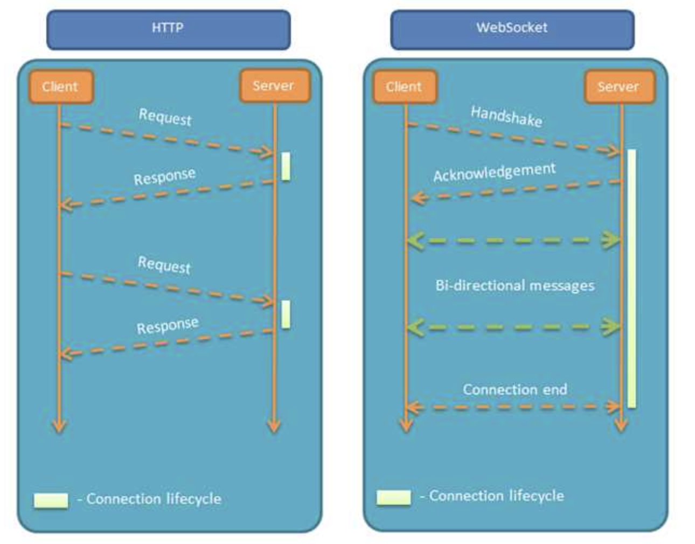
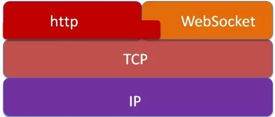

# Vue + Node —— Socket通信

最近着手毕业设计作品，主题是在线运行代码网站。

普通执行返回内容（消息推送至前端SSE"Server-sent Events"）觉得平平无奇，我的想法是可以实现**终端交互**，用户提交执行代码请求后，前端有控制台直接控制后端Docket容器，这里面就涉及Socket通信技术，通过前后端建立起Socket通信，即可将后端的Docket容器暂时交由给用户进行操作，这样一来，用户自定义的输入内容都可以被他自己编写的程序所接收到。

在介绍技术插件选择之前，我们不妨先了解下WebServer与Browser/UserAgent的通信演化

## 前后端数据传输

假设我们的网站现在需要一些实时数据的展示，例如股票实时行情、火车剩余票数等这类数据获取。这些数据用户不希望反复刷新网站获得，而是更希望网站上动态的，数据一直在网站上面进行自动更新。

早期，在WebSocket标准没有推出之前，AJAX轮询是一种可行的实时更新数据的方案。

> ​	我们知道**HTTP协议是一种单向的网络协议**，在建立连接后，仅允许Browser/UserAgent向WebServer发出请求资源后，WebServer才能返回对应的数据，而WebServer不能主动的推送数据给Browser/UserAgent。
>
> ​	最初这么设计HTTP协议的原因是，假设WebServer能主动的推送数据给Browser/UserAgent，那么Browser/UserAgent就太容易受到攻击了，<u>一些广告商也会主动把广告在不经意间强行的传输给客户端</u>，这不能不说是一个灾难。
>
> ​	AJAX轮询原理是设置定时器，定时通过AJAX同步服务端数据。这种方式存在延时且对服务端造成很大负载。直至2011年，IETF才标准化WebSocket - 一种基于TCP套接字进行收发数据的协议。

### 常见的的AJAX轮询

- Polling

  > ​	**Polling轮询是通过Browser/UserAgent定时向WebServer发送HTTP请求**，WebServer收到请求后把最新的数据发回给Browser/UserAgent，Browser/UserAgent得到数据后将其显示，然后再定期重复此过程。
  >
  > ​	虽然这样可以满足需求，但仍存在问题，例如某段时间内WebServer没有更新的数据，但Browser/UserAgent仍然会定时发送请求过来询问，WebServer可以把以前的老数据再传送过去，Browser/UserAgent把这些没有变化的数据再显示出来。这样既浪费网络带宽，有浪费CPU利用率。
  >
  > ​	如果说把Browser/UserAgent发送请求的周期调大一些，就可以缓解这个问题，但如果WebServer的数据更新很快时，这样又不能保证Web应用获取数据的实时性。

- LongPolling

  > LongPolling是对Polling的一种改进。
  >
  > Browser/UserAgent发送HTTP请求到WebServer，此时WebServer可以做2件事情：
  >
  > 1. 如果WebServer有新的数据需要传送，就立即把数据发回给Browser/UserAgent，Browser/UserAgent收到数据后，立即再发送HTTP请求给WebServer。
  > 2. 如果WebServer没有新数据需要传送，这里与Polling的方式不同的是，WebServer不是立即发送回应给Browser/UserAgent，<u>而是将这个请求保持住</u>，等待有新的数据来到，再去响应这个请求。当然，如果WebServer的数据长期没有更新，一段时间后，这个HTTP请求就会超时，Browser/UserAgent收到超时信息后，在立即发送一个新的HTTP请求给服务器，然后依次循环这个过程。
  >
  > LongPolling的方式虽然在某种程度上减少了网络带宽和CPU利用率等问题，**但仍存在缺陷**。
  >
  > ​	**例如**WebServer的数据更新速度较快，WebServer在传送一个数据包给Browser/UserAgent后必须等待Browser的下一个HTTP请求到来，才能传递第二个更新的数据包给Browser。这样的话，Browser显示实时数据最快的时间为2 xRTT（往返时间）。另外在网络拥堵的情况下，这个应该是不能让用户接受的。另外，由于HTTP数据包的头部数据量很大（通常有400多个字节），但真正被服务器需要的数据却很少（有时只有10个字节左右），这样的数据包在网络上周期性传输，难免对网络带宽是一种浪费。

综上所述，要是在Browser有一种新的网路一些，能支持客户端和服务端的双向通信，而且协议的头部又不那么庞大就very nice了。WebSocket正是肩负这样的使命登上了Web的舞台。

### WebSocket 通信原理

WebSocket是一种双向数据通信协议，与HTTP一样也是通过TCP来传输数据，但与HTTP不同的是：

- WebSocket是双向数据通信协议，建立通信后，双方（WebServer与Browser/UserAgent）均可以向对方主动传输、接收数据。与Socket不同的是，WebSocket是一种建立在Web基础上的简单模拟Socket的协议。
- WebSocket需要通过握手🤝连接，连接成功后才能相互通信。

## 

### WebSocket与TCP、HTTP的关系

WebSocket与HTTP协议一样都是基于TCP的，所以它们都是可靠的协议，Web开发者调用的`WebSocket`的`send`函数在Browser的实现中最终都是通过TCP的系统接口进行传输的。

值得注意的是，WebSocket和HTTP协议样都属于应用层协议，当WebSocket在建立握手连接时，数据是通过HTTP协议传输的。但在建立连接之后，真正的数据传输阶段是不需要HTTP参与的。

## Socket.io 

​	node.js提供了高效的服务端运行环境，但是由于浏览器端对HTML5的支持不一，为了兼容所有浏览器，提供卓越的实时的用户体验，并且为程序员提供客户端与服务端一致的编程体验，于是socket.io诞生。

​	`Socket.IO`是一个WebSocket库，可以在浏览器和服务器之间实现实时，双向和基于事件的通信。它包括：Node.js服务器库、浏览器的Javascript客户端库。它会自动根据浏览器从WebSocket、AJAX长轮询、Iframe流等等各种方式中选择最佳的方式来实现网络实时应用，非常方便和人性化，而且支持的浏览器最低达IE5.5。

