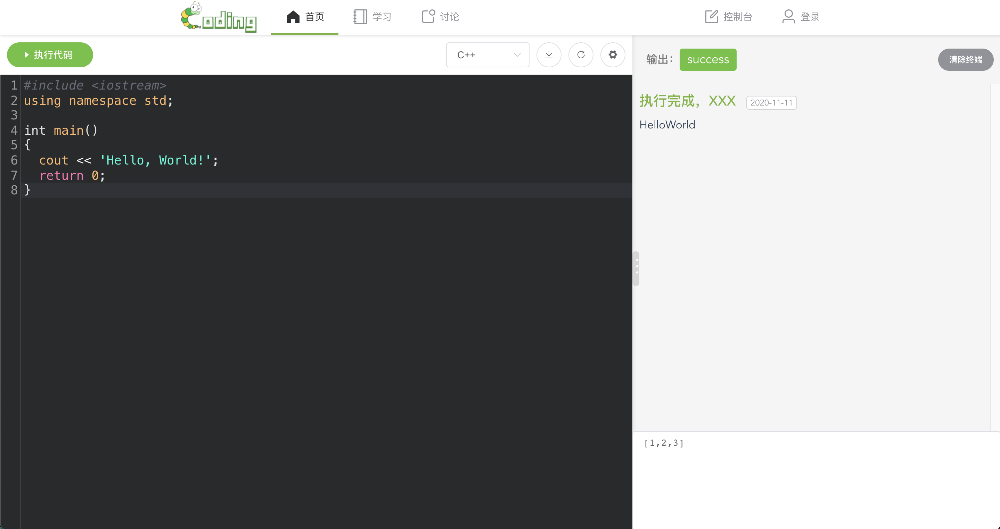
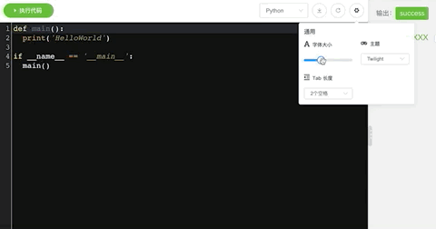

# 码虫客栈——Web终端页面技术点



## 界面

页面选用了Element Ui库中的Button、Input、Tabs、Select、Slider等组件。

## 代码编辑器库

### 1.选型

前端的网页代码编辑器插件主流基本会选用 Ace Editor 与 CodeMirror ，本页面中选用 [CodeMirror](https://codemirror.net/index.html) 库。

> CodeMirror 是一款“Online Source Editor”，基于Javascript，短小精悍，实时在线代码高亮显示，他不是某个富文本编辑器的附属产品，他是许多大名鼎鼎的在线代码编辑器的基础库

### 2.使用

在 Vue 中非常简单，命令 npm install vue-codemirror 安装，在 main 文件中引入 CodeMirror 即可：

```javascript
// CodeMirror 代码编辑器
import VueCodeMirror from 'vue-codemirror';
import 'codemirror/lib/codemirror.css';
```

声明组件、引入基本主题、功能：

```javascript
// 选中行高亮
import "codemirror/addon/selection/active-line";
// -----------引入所有主题-----------
import "codemirror/theme/mdn-like.css";
import "codemirror/theme/xq-light.css";
import "codemirror/theme/twilight.css";
import "codemirror/theme/shadowfox.css";
import "codemirror/theme/rubyblue.css";
import "codemirror/theme/panda-syntax.css";
// -----------引入所有主题-----------

// -----------引入所有语言-----------
require("codemirror/mode/javascript/javascript");
require("codemirror/mode/python/python");
require("codemirror/mode/go/go");
require("codemirror/mode/clike/clike.js");
// -----------引入所有语言-----------

export default {
  // 注册组件
  components:{
    codemirror
  },
}

```

```vue
<template>
	<codemirror  
              ref="mycode"  
              :value="item.content"  
              :options="cmOptions"
              class="code"></codemirror>
</template>
```

其中 options 为该代码编辑器的基本配置项：

> **value: string|CodeMirror.Doc**
> 编辑器的起始值。可以是字符串，也可以是文档对象。
>
> **mode: string|object**
> 使用的模式。如果没有给出，这将默认为加载的第一个模式。...
>
> **theme: string**
> 用编辑器设计样式的主题。您必须确保.cm-s-[name] 已加载定义相应样式的CSS文件（请参阅theme分发中的目录）。
>
> **tabSize: integer**
> 制表符的宽度。默认为4。
>
> **smartIndent: boolean**
> 是否使用模式提供的上下文相关缩进（或者只是缩进与之前的行相同）。默认为true。
>
> **lineNumbers: boolean**
> 是否在编辑器左侧显示行号。
>
> **styleActiveLine: boolean**
> 是否为选中行高亮。
>
> ......

项目中默认配置：

```javascript
export default{
  data() {
    return {
      // 配置 code-mirror
      cmOptions: {
        tabSize: 2, // 默认制表符大小
        mode: "text/x-python", // 默认语法
        theme: "mdn-like", // 默认主题
        smartIndent: true,
        lineNumbers: true,
        styleActiveLine: true,
      },
    };
  }
}
```


### 3.适配

复用：在本项目中，考虑到使用到编辑器的地方不止这一个页面，故把该组件抽离成公共的组件，以便在后续各个页面中进行敷用。

直观的调节效果：编辑器与编辑器菜单是分离开来的组件（考虑到后续出现的场景中，编辑器会独立出现），所以在此页面的代码编辑器设置（主题、字体大小、TabSize）中选用的是Vuex进行基本配置的改变。

在 store 中定义 state ：

```javascript
export default new Vuex.Store({
    state: {
    // 默认值
    EditConfig: {
      e_fontSize: 18,
      e_snippet: '',
      e_lang: 'default',
      e_theme: 'mdn-like',
      e_tablen: 2,
      e_mode: 'text/x-c++src'
    }
  },
})
```

相关对应的 mutations：

```javascript
mutations: {
  // 为 store 中 fontSize 赋值
  setFontSize(state, val) {
    state.EditConfig.e_fontSize = val;
  },
  // 设置lang
  setLang(state, val) {
    state.EditConfig.e_lang = val;
  },
  // 设置snippet
  setSnippet(state, val) {
    state.EditConfig.e_snippet = val;
	},
	// ...
}
```

在 代码编辑器 组件中监控这几个状态：

```javascript
export default{
  // 将 state 中的对象挂载值此组件中
  computed:{
    ...mapState(['EditConfig'])
  },
  watch: {
    // 监控 state 编辑器配置对象中的直是否发生改变
    "EditConfig.e_theme": {
      handler(v) {
        this.cmOptions.theme = v;
      },
    },
    "EditConfig.e_tablen": {
      handler(v) {
        this.cmOptions.tabSize = v;
      },
    },
    // ...
  }
}
```

其余可在组件属性中直接绑定：

```vue
<codemirror 
            :value="EditConfig.e_snippet" 
            :style="{ fontSize: EditConfig.e_fontSize + 'px' }">
</codemirror>
```

？为什么某一部分的状态需要 watch 去监视到变化后再写入此组件中的 data 呢？某一部分的状态又不需要。

！是因为在 CodeMirror 中 Value(编辑器内容)、font-Size，均可以直接在组件属性中进行传值，但例如theme(主题)、tabSize(制表符长度)等不可以直接在组件属性中进行传值。

效果图：



## 页面布局调节

### 1.需求

整体页面的布局为：左-代码编辑器，右-终端输出。有时候写代码嫌单行太长了或者代码展示的宽度太小了需要进行调整。

### 2.实现

在左div与右div中加一个负责拖放的竖条进行拖动调整两边的宽度：

```vue

<template>
  <div class="globalContent">
    <!-- 左侧代码编辑区 -->
    <div class="h-100 left">
      <div class="CodeEdit h-100">
        <!-- 代码菜单栏 -->
        <Menu />

        <!-- 代码编辑器 -->
        <Code />
      </div>
    </div>

    <!-- 右侧控制台 -->
    <div class="h-100 mid">
      <div class="resize" title="收缩侧边栏">⋮</div>

      <Terminal />
    </div>
  </div>
</template>
```

在 methods 中添加主要处理事件：

```javascript
methods: {
    dragControllerDiv: function () {
      var resize = document.getElementsByClassName("resize"); // 竖条
      var left = document.getElementsByClassName("left");
      var mid = document.getElementsByClassName("mid");
      var box = document.getElementsByClassName("globalContent");
      resize[0].onmousedown = function (e) {
        //颜色改变提醒
        resize[0].style.background = "#818181";
        var startX = e.clientX;
        resize[0].left = resize[0].offsetLeft;
        // // 鼠标拖动事件
        document.onmousemove = function (e) {
          var endX = e.clientX;
          var moveLen = resize[0].left + (endX - startX); // （endx-startx）= 移动的距离。resize[0].left+移动的距离=左边区域最后的宽度
          var maxT = box[0].clientWidth - resize[0].offsetWidth; // 容器宽度 - 左边区域的宽度 = 右边区域的宽度
          if (moveLen < 500) moveLen = 500; // 左边区域的最小宽度为32px
          if (moveLen > maxT - 300) moveLen = maxT - 300; //右边区域最小宽度为150px
          left[0].style.width = moveLen + "px";
          mid[0].style.width = box[0].clientWidth - moveLen  + "px";
        };
        // // 鼠标松开事件
        document.onmouseup = function () {
          //颜色恢复
          resize[0].style.background = "#d6d6d6";
          document.onmousemove = null;
          document.onmouseup = null;
          resize[0].releaseCapture && resize[0].releaseCapture(); //当你不在需要继续获得鼠标消息就要应该调用ReleaseCapture()释放掉
        };
        resize[0].setCapture && resize[0].setCapture(); //该函数在属于当前线程的指定窗口里设置鼠标捕获
        return false;
      };
    },
  },
```

### 原理

​	拖动效果的实现基本都是dom操作来实现的，通过拖动分隔线，计算分隔线与浏览器边框的距离(left)，来实现拖动之后的不同宽度的计算；当拖动分隔线1时，计算元素框left和mid；当拖动分隔线2时，计算元素框mid和right；同时设置元素框最小值以防止元素框拖没了（其实是被遮住了）。使用SetCapture() 和 ReleaseCapture()的函数功能指定窗口里设置鼠标捕获。


## 终端交互

### 1.构思

最初的想法是有一个类似终端Input、Output的过程，用户可自行操控自己编写的程序的输入需求。

一开始最为直接的方法是使用 WebSocket 发起一次连接，使用一个 <div> 显示服务端推送过来的信息，用户使用 <textarea> 推送消息给服务器。
它的缺点在于交互效果并不简单，一般的终端皆是输出与输入结合在一起，在网站上面若是分开那么会令用户的体验感不好。于是寻找了众多资料，发现了这样的一个插件：**Xterm.js**

Xterm.js 是一个用于在浏览器中构建终端的插件，易用、快速上手。它被用于多个世界级的应用程序中（大名鼎鼎的Vscode也在使用此插件），以提供出色的终端体验。

### 2.构建

安装

```shell
npm install xterm
```

简单上手

```html
<div style="height: 100%; background: #002833;">
  <div id="terminal" ref="terminal"></div>
</div>
<script>
  // 引入 Xterm.js
  import { Terminal } from "xterm";
	var term = new Terminal();
  term.prompt = () => {
    // 指令开头
    term.write("\r\n$ ");
  }
	term.open(this.$refs['terminal']);
  term.writeln("Welcome to use Xterm");
  term.prompt();
</script>

```

