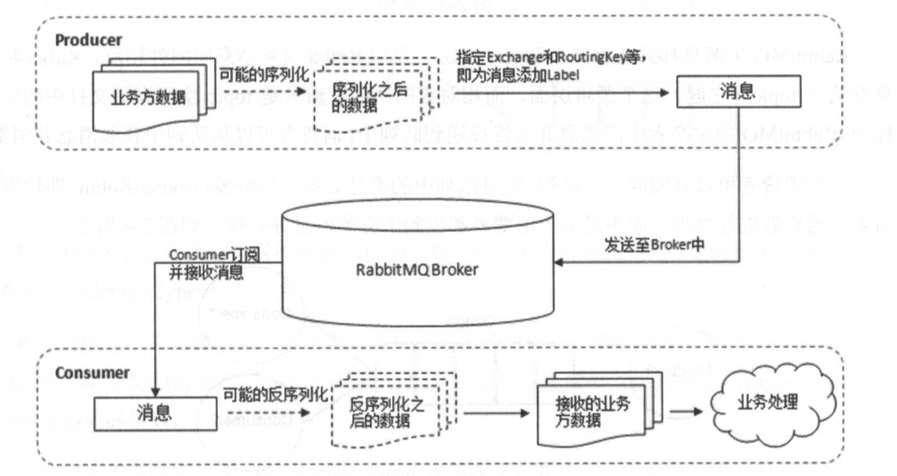
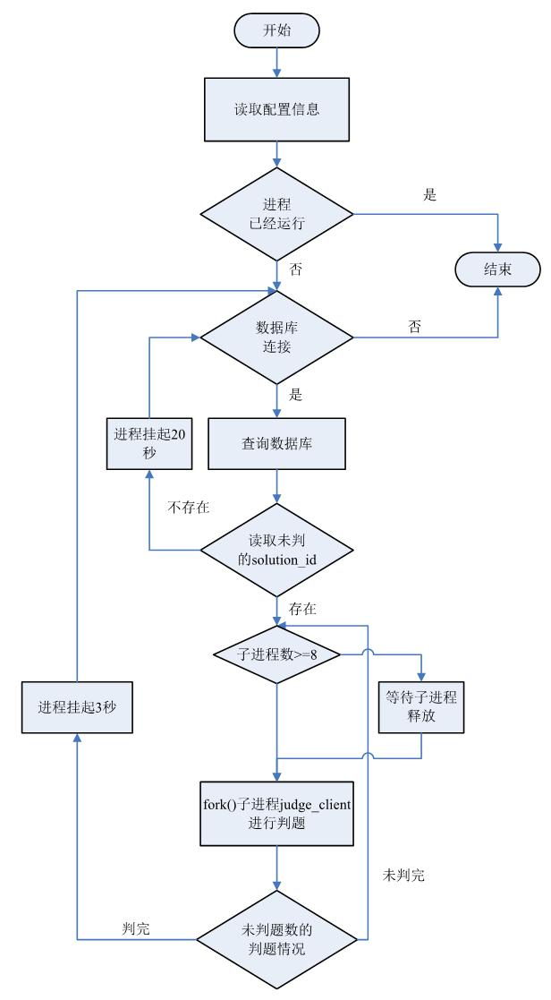
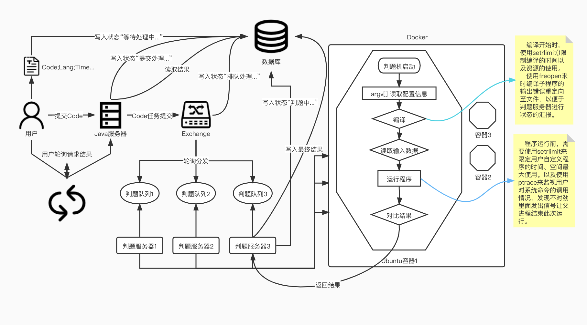
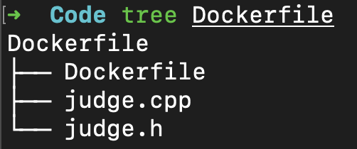
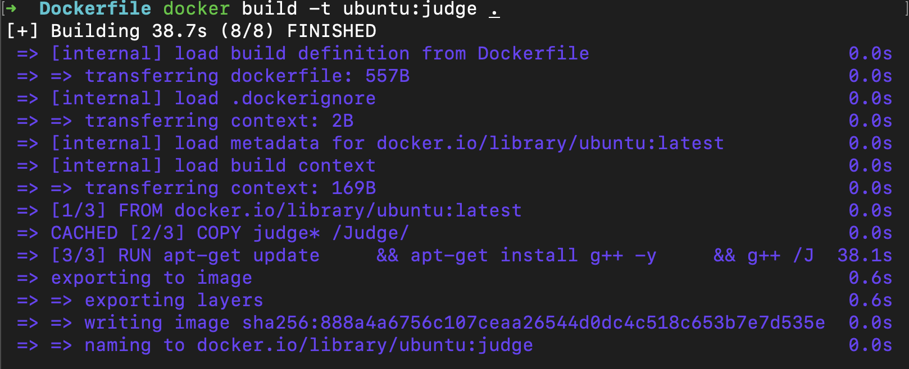

# 码虫客栈——任务

1. ### 确定Online Judge基本架构

2. ###  深入了解判题系统的原理

3. ### 清晰RabbitMQ在此项目中的作用

4. ### 编写定时爬虫任务（爬取题目、测试用例）至服务器


## 日学习进度

### 12.1

1. 大致阅读了 judge.cpp 实现原理，了解它是如何进行判题的，fork启动子进程、execvp调用编译、setrlimit 限制资源使用、定时器 alarm 定时、< > 重定向输入输出

2. RabbitMQ 学习至 Topic 模式，初步了解三种模式的工作形态。

3. 大致梳理了整体 Online Judge 的架构。

   > - 用户发送请求至服务器( NodeJS )，服务器进行整合请求并生成**UUID**写入数据库标记Waiting，同时生产者发送对象（Code、Lang...）至 RabbitMQ，随后数据库标记为 Pending 。
   > - 在Docker容器中的Java消费者程序收到RabbitMQ推送的消息后，数据库标记Processing，随后把对象（Code、Lang...）作为参数附加给Judge程序进行判题。
   > - Judge程序被启动后数据库标记Analyzing，C语言编写的Judge程序先行把Code写为文件形式，随后根据Lang类型使用fork、execvp进行编译，编译完毕后再次使用三剑客进行启动子程序，这一步限定子程序（用户代码）的资源使用setrlimt([**RLIMIT_CPU**:CPU运行时间,**RLIMIT_AS**:进程的虚拟内存最大大小...])，使用alarm 定时器进行限定运行时间，参数中 command > file 输出重定向至file文件、command < file 输入重定向至file文件，这样一来只需要把正确的答案对比输出的file文件即可。
   > - Judge最后把结果写入至数据库即完成判题的全部流程。

### 12.2

1. 重新梳理了**<u>CPU运行时间</u>与<u>实际运行时间</u>**的概念（昨天的疑惑🤔）：

> CPU时间：指的是一段程序在CPU上面运行消耗的时间，也是内核时间（kernel time)。
>
> 系统时间(wall clock time, elapsed time)：是指一段程序从运行到终止，系统时钟走过的时间。
>
> CPU时间指标是CPU上花费的时间，**不包括等待I/O或运行其他程序**的时间。

​	rlimit函数仅仅只能进行CPU时间的控制，不能控制实际运行的时间，所以像是 sleep 或者 IO 阻塞之类的情况是没有办法的，所以还在额外添加了一个 alarm 来进行实际时间的限制。

2. 使用ptrace函数的原因😄：

   > 因为用户提交过来的代码中可能存在恶意代码，即使使用了rlimit去限制资源的使用，那也无法避免fork之类的可能存在的恶意操作的代码，所以外加一层稳妥的方法就是使用ptrace函数，ptrace函数附加在子进程上面，进行所有系统调用的统计过滤等等...，一有超出异常的情况就发出信号让父进程捕获，让父进程终止子进程的运行，并把情况告诉给数据库。

两个疑惑点梳理：

> `rlimit` ：是基于进程的。`rlimit` 可确立对某个进程占用各种系统资源的限制。由该进程创建的每个进程均从其原始进程继承此资源限制。资源限制由一对值来定义。这些值指定了当前（软）限制和最大（硬）限制。

> `ptrace`：进程跟踪（process trace）系统调用通常都与调试有关。它是类 Unix 系统上通过原生调试器监测被调试进程的主要机制。它也是实现 `strace`（系统调用跟踪system call trace）的常见方法。使用 Ptrace，跟踪器可以暂停被跟踪进程，**检查和设置寄存器和内存**，监视系统调用，甚至可以拦截（intercepting）系统调用。

3. 进一步认识RabbitMQ几种模式，了解Work模式中轮询与公平分发机制：

> 补充昨天一点：
>
> ​	判题服务器（消息队列监听）放在Docker容器上运行着，一个判题服务器负责一个 **判题机** 任务的颁发，在RabbitMQ Work模式中，使用公平分发策略来均衡的推送任务给几个**判题服务器**，若其中一个**判题服务器**崩溃了则回报给**消息队列**...，知识没跟上，明天补充😭。

4. 认识SpringBoot中如何编写生产者以及消费者的相关代码。

### 12.3

1. 翻越了大量文章去认识与了解`ptrace`函数的使用，但是在一般的Intel与AMD中可以使用`ORIG_EAX`常量，这个代表的是系统调用号。

   > ​	Linux所有的系统调用都是通过软中断 int 0x80来实现的，而系统调用号是存在寄存器EAX中的. 所以如果想获取系统调用号，只需要获取ORIG_EAX的值就可以了。

   但是在M1 ARM架构中并没有这个常量的值。所有的系统调用都是通过SWI来实现的，虽然也是软中断，但方式不同，因为在ARM 架构中有两个SWI指令，分别针对EABI和OABI 。后续不清楚如何获取到ARM架构中的系统调用号，所以暂时不得不放弃使用`ptrace`函数。

2. RabbitMQ 高级部分 - TTL -> 设置队列的过期时间，应用场景：支付超过时间则默认取消；TTL消息过期时间 -> 单条设置过期时间通过在生产者中`MessagePostProcessor`

   ```java
   MessagePostProcessor messagePostProcessor = new MessagePostProcessor() {
     @Override
     public Message postProcessMessage(Message message) throws AmqpException {
       // 设置单条信息过期时间
       message.getMessageProperties().setExpiration(5000); // 5秒
       return message;
     }
   };
   // 发送
   rabbitTemplate.convertAndSend(exchangeName, routingKey, messageContent, messagePostProcessor);
   ```

### 12.4



1. RabbitMQ 中的死信队列，故名思义它是用来管理已经被抛弃的信息的队列，俗称`备胎队列`，它是收集一个设置了TTL过期时间队列中，过期后的消息来到了死信队列（有点像`垃圾桶`）。

   ​	在声明中配置好交换机与队列的绑定关系：

```java
@Configuration
public class TTLRabbitMqConfiguration {
    @Bean
    public DirectExchange ttlDirectExchange(){
      	// 交换机名称：ttl_direct_exchange
        return new DirectExchange("ttl_direct_exchange",true,false);
    }
    @Bean
    public Queue directTTLQueue(){
        Map<String ,Object>args = new HashMap<>();
        // 超时时间设置
        args.put("x-message-ttl",5000);
        // 死信队列绑定，direct 模式下需要附加 RoutingKey
        args.put("x-dead-letter-exchange", "dead_direct_exchange"); // 绑定死信队列
        args.put("x-dead-letter-routing-key", "dead"); // 死信队列对应的 RoutingKey
      	// 队列名称：ttl.direct.queue
        return new Queue("ttl.direct.queue",true,false,false,args);
    }
    @Bean
    public Binding directTTLBinding(){
        return BindingBuilder.bind(directTTLQueue()).to(ttlDirectExchange()).with("ttl");
    }
}
```

​	声明死信队列：	

```java
@Configuration
public class DeadRabbitMqConfiguration {
    @Bean
    public DirectExchange deadDirectExchange() {
        return new DirectExchange("dead_direct_exchange", true, false);
    }
    // 死信队列
    @Bean
    public Queue deadDirectQueue() {
        return new Queue("dead.direct.queue");
    }
    @Bean
    public Binding deadDirectBinding() {
        return BindingBuilder.bind(deadDirectQueue()).to(deadDirectExchange()).with("dead");
    }
}
```

生产者往被绑定好死信队列的交换机生产消息：

```java
// 高级 TTL消息过期时间
public void makeOrderDirectTTL() {
  String orderId = UUID.randomUUID().toString(); // 随机UUID
  System.out.println("订单队列派发成功OrderId->" + orderId);
  String exchangeName = "ttl_direct_exchange";
  String routingKey = "ttl";
  rabbitTemplate.convertAndSend(exchangeName, routingKey, orderId);
}
```

补充说明：

​	消息变成死信，有下面几个可能：

> - 消息被拒绝
> - 消息过期
> - 队列达到最大长度


### 	12.4

1. 接触到一个非常危险的代码：`main[-1u]={1};`

> 无符号算术的模数比给定类型的最大值多一个。
>
> 因此`-1U`为`-1 + MAX_UINT + 1`，在`2^32-1`的架构上为`unsigned == uint32_t`。如果你的`sizeof(int) == 4`， `int x[-1U] = {1};`将需要`4*(2^32-1) B =~ 16 GiB`存储，并且存储不会被删除，因为它不是全零。

2. 尝试使用python 中 resource库的setrlimit限制子进程的资源使用，但是在M1的OSX中使用该方法会出现一些python的错误，python官方给出的回复：

   > ​	现在在较新版本的 macOS（显然是 10.14.4 版）中运行时存在一些情况，即尝试在运行时使用 resource.RLIMIT_STACK 增加堆栈限制失败。如果您确实需要增加堆栈限制，以处理更深层次的递归等，一种解决方案是使用更大的堆栈大小为 macOS 重建 Python，如PR 14546所示，而不是尝试在运行时更改它。

   继续熟悉`setrlimit`（测试电脑计算次数程序）：

   ```c
   //
   //  main.c
   //  Fork
   //
   //  Created by 黄泽旭 on 2021/12/1.
   //
   #include <sys/resource.h>
   #include <stdio.h>
   #include <unistd.h>
   #include <stdlib.h>
   #include <signal.h>
   void sighandler(int);
   int i = 0;  
   int main(int argc, const char * argv[]) {
     signal(SIGXCPU, sighandler);
   
     struct rlimit new_lim;
   
     new_lim.rlim_cur = 1;
     new_lim.rlim_max = 5;
   
     setrlimit(RLIMIT_CPU, &new_lim);
   
     int count = 0;
   
     for (;i<1000000000; i++) {
         count += i;
     }
     printf("result %d\n",count);
     return 0;
   
   }
   void sighandler(int signum)
   {
     printf("您的电脑一秒钟可计算%d次\n",i);
     exit(1);
   }
   ```

   4. 在OS X系统中使用`setrlimit`设置虚拟内存大小`RLIMIT_AS`会失败。

   5. 大致把判题机的伪代码写完：

      ```c
      //
      //  main.c
      //  Fork
      //
      //  Created by 黄泽旭 on 2021/12/1.
      //
      #include <sys/resource.h>
      #include <stdio.h>
      #include <unistd.h>
      #include <stdlib.h>
      #include <signal.h>
      
      #include <sys/types.h>
      #include <sys/wait.h>
      #define FILE_SIZE 10
      #define MB 1048576
      
      
      void sighandler(int);
      void setrlimit__();
      int compile();
      void run();
      void judge();
      int main(int argc, const char * argv[]) {
      
        int status = compile();
        printf("This Status is: %d\n",status);
      
        judge();
        return 0;
      }
      
      // 代码编译
      int compile(){
        int time_limit = 6;
      
        const char *COMP_C[] = {"gcc","-Wall","-lm","Main.c","-o","Main",NULL};
      
        pid_t pid = fork();
        if(pid == -1){
          printf("Error:\n");
          return -1;
        }else if(pid != 0){ // parent
          int status;
          waitpid(pid, &status, 0);
          return status;
        }else{ // child
          // 设置编译时的资源限制
          struct rlimit lim;
          lim.rlim_cur = lim.rlim_max = time_limit;
          // 设置CPU运行时间
          setrlimit(RLIMIT_CPU, &lim);
          // 设置实际运行时间 -> 定时器
          alarm(0);
          alarm(time_limit);
      
          // ... 
      
          // 重定向此子进程的错误输出到文件
          freopen("error.dat","w",stderr);
          execvp(COMP_C[0],(char* const*)COMP_C);
          exit(0);
        }
        return 0;
      }
      
      // 判题
      void judge(){
        // ... 获取最大时间以及空间
      
      
        // 运行程序
        pid_t pidRun = fork();
        if(pidRun == 0){ // child
          run();
          exit(0);
        }else{
          // 监视时间空间...
        }
        
      }
      
      // 运行程序
      void run(){
        int time_limit = 2000; // 假设题目要求2秒
      
        // 题目的限定资源
        struct rlimit lim;
      
        // 限定CPU时间以及实际运行时间
        lim.rlim_cur = lim.rlim_max = time_limit / 1000.0 + 1;
        setrlimit(RLIMIT_CPU, &lim);
        alarm(0);
        alarm(time_limit / 1000.0+1);
      
        // 限定进程可以创建的最大文件大小
        lim.rlim_max = (FILE_SIZE<<20) + MB;
        lim.rlim_cur = FILE_SIZE<<20;
        setrlimit(RLIMIT_FSIZE, &lim);
      
        // 限定进程堆栈的最大大小，以字节为单位。
        lim.rlim_cur = lim.rlim_max = MB << 6;
        setrlimit(RLIMIT_STACK, &lim);
      
        execl("./Main","./Main",NULL);
      }
      ```

      

   ### 12.5

   

   1. 重新温习了DockerFile，了解了CMD与ENTRYPOINT的区别：

   > `ENTRYPOINT` 指定的命令需要与`docker run` 启动容器进行搭配，将docker run 指令后面跟的内容当做**参数**作为ENTRYPOINT指令指定的运行命令的参数，ENTRYPOINT 指定的linux命令一般是不会被覆盖的。

		2.	Judge 流程：






3. 了解一个概念：`Special Judge`

> 对于同一道题目，用户可能使用各种不同的方法来解答，所以对于某些特殊的题目，其结果可能不唯一，但都符合题目要求。此类题目就需要进行特判(Special Judge)。
>
> 例如：**给出一个不小于 12 的正整数n，请你输出两个合数，使他们的和等于n。**
>
> 分析题意，可以得出系统判断用户输出是否正确的两个条件是：输出的两个数是否均为合数；输出的两个数之和是否为n。
>
> 首先分别制定data.in（测试输入）、data.out（测试输出）如下：
>
> `filename: data.in`
>
> ```shell
> 1
> 2
> 3
> 4
> 3
> 12
> 15
> 1000
> ```
>
> `filename: data.out`
>
> ```shell
> 1
> 2
> 3
> 8 4
> 9 6
> 500 500
> ```
>
> 解决方案：
>
> 一般的题目判题机运行完后重定向输入，随后对比一下标准输出与用户输出是否一致即可判定。
>
> 先把`data.in`数据扔给用户写的程序进行运行随后重定向用户输出数据为user.out，随后执行管理员写好的`spj.cc`（特判程序）进行特殊判定，特殊程序会读入`data.in`（测试输入）、`data.out`（测试输出-<u>可以不用</u>）、`user.out`（用户输出），程序先把测试输入进行**行拆分**，随后同样方式读取用户行数据，把用户数据以特定判定方式处理后与**测试输入**进行比对，对比相等即视为AC(Accept)。返回成功结果后，判题机会收到结果随后进行汇报。
>
> 对于以上题目可有下面的**特判程序**
>
> ```c
> #include <stdio.h>
> bool is_prime(int x) {
>     for(int i = 2; i <= n / 2; i++) {
>         if(n % i == 0) {                   //符合该条件不是素数
>             return true;
>         }
>     }
> }
> int main(int argc, char *args[]) {
>     FILE * f_in   = fopen(args[1], "r");    //测试输入
>     FILE * f_out  = fopen(args[2], "r");    //测试输出
>     FILE * f_user = fopen(args[3], "r");    //用户输出
>     int ret = 0;                            //返回值
>     int T, n, a, b;
>     fscanf(f_in, "%d", &T);                 //从输入中读取数据组数T
>     while(T--) {
>         fscanf(f_in  , "%d"  , &n    );
>         fscanf(f_user, "%d%d", &a, &b);
>         if(a + b != n || is_prime(a) || is_prime(b))
>         ret = 1;                            //Wrong Answer
>     }
>     fclose(f_in);
>     fclose(f_out);
>     fclose(f_user);
>     return ret;
> }
> ```
>
> 第二种特殊题型：**经过一定复杂计算后输出一个实数结果，精度要求控制在10−4 内。**
>
> 代码如下：
>
> ```c
> #include <stdio.h>
> const double eps = 1e-4;
> int main(int argc,char *args[]) {
>     FILE * f_in   = fopen(args[1], "r");    //测试输入
>     FILE * f_out  = fopen(args[2], "r");    //测试输出
>     FILE * f_user = fopen(args[3], "r");    //用户输出
>     int ret = 0;                            //返回值
>     int T;
>     double a, x;
>     fscanf(f_in, "%d", &T);                 //从输入中读取数据组数T
>     while(T--) {
>         fscanf(f_out , "%lf", &a);
>         fscanf(f_user, "%lf", &x);
>         if(fabs(a-x) > eps) {
>             ret = 1;                        //Wrong Answer
>         }
>     }
>     fclose(f_in);
>     fclose(f_out);
>     fclose(f_user);
>     return ret;
> }
> ```
>
> 

### 12.6

1. 确定判题机Main接受参数：

   > `c`CodePath：传进来的用户代码路径，可以直接对需要判题的代码进行编译、运行操作。
   >
   > `d`CodeUid：提交任务代码的ID串，用来保存用户输出数据。
   >
   > `l`Lang：语言运行环境；1: C语言、2: C++语言、3: Python...。
   >
   > `t`TimeLimit：时间限制，指实际运行的时间，包括I/O等待时间
   >
   > `r`RunDir: 运行代码的目录，结果存放的位置
   >
   > `e`ExampleDir: 题目样例目录位置，自动读取目录下所有的题目
   >
   > `s`CustomInput: 用户自定义输入的文件路径
   
   > MemLimit：空间限制，单位MB。// 各大网站不准确，放弃。
   >
   > 例子：
   >
   > ```shell
   >sudo ./Run /Users/huangzexu/Code/C-C++/test/Main.c 0f44a62825d16b301e9c330bad507788 1 1
   > 
   >sudo ./Run -c /Users/huangzexu/Code/C-C++/test/Main.cpp -d 0f44a62825d16b301e9c330bad507788 -l 1 -t 1 -r /Users/huangzexu/Code/C-C++/test -e /Users/huangzexu/Code/C-C++/test/28485
   > ```

### 12.13

这几天有点其他事情忙活了，没怎么更新进度。

1. 编写判题机，最后剩余多测试样例下的代码以及接入测试。


### 12.14

题目`20981`：

```shell
sudo ./Run -c /Users/huangzexu/Code/C-C++/test/Main.cpp -d 0f44a62825d16b301e9c330bad507788 -l 1 -t 1 -r /Users/huangzexu/Code/C-C++/test -e /Users/huangzexu/Code/C-C++/test/20981
```

1. c++中的读写二进制`ifstream`

   >ofstream是从内存到硬盘，ifstream是从硬盘到内存，其实所谓的流缓冲就是内存空间

```c++
/*
 * 读入文件数据至string
 */
string readFileIntoString(string filename)
{
  ifstream ifile(filename);
  //将文件读入到ostringstream对象buf中
  ostringstream buf;
  char ch;
  while (buf && ifile.get(ch))
    buf.put(ch);
  //返回与流对象buf关联的字符串
  return buf.str();
}
```

sudo /Judge/Run -c /Judge/1992.cpp -d 0f44a62825d16b301e9c330bad507788 -l 1 -t 1 -r /Judge -e /Subject/1992

### 12.17

1. 关于多台判题服务器的题库数据如何关联：

   

   > 默认情况下，在容器内创建的所有文件都存储在可写容器层上。这意味着：
   >
   > - 当该容器不再存在时，数据不会保留，如果另一个进程需要数据，则很难将数据从容器中取出。
   > - 容器的可写层与运行容器的主机紧密耦合。您无法轻松地将数据移动到其他位置。
   > - 写入容器的可写层需要[存储驱动程序](https://docs.docker.com/storage/storagedriver/)来管理文件系统。存储驱动程序使用 Linux 内核提供联合文件系统。与使用*数据卷*相比，这种额外的抽象降低了性能，数据卷直接写入主机文件系统。
   >
   > Docker 为容器提供了两个选项，用于将文件存储在主机中，以便即使在容器停止后仍保留文件：*卷*和*绑定装载*。

   ​	在宿主机上通过命令创建多个容器，将其均挂载至宿主机的题目数据目录，为了安全着想，"读写分离"，宿主机上面运行多一个服务负责管理题目增删改查...，容器里不能直接对该目录进行修改操作，只允许读。

Docker中的只读卷：

>​	对于某些开发应用程序，容器需要写入绑定装载，以便将更改传播回 Docker 主机。在其他时候，容器只需要对数据的读取访问权限。请记住，多个容器可以装载同一个卷，并且可以同时为其中一些容器进行读写装载，而对其他容器进行只读装载。
>
>此示例修改了上面的内容，但将目录作为只读卷挂载，方法是将`ro`添加到容器内装入点之后的选项列表中（默认情况下为空）。如果存在多个选项，请用逗号分隔。
>
>`--mount`和`-v`示例具有相同的结果。
>
>`--mount`
>
>```shell
>docker run -d \
>  --name=nginxtest \
>  --mount source=nginx-vol,destination=/usr/share/nginx/html,readonly \
>  nginx:latest
>```
>
>`-v`
>
>```shell
>docker run -d \
>  --name=nginxtest \
>  -v nginx-vol:/usr/share/nginx/html:ro \
>  nginx:latest
>```

2. 关于RabbitMQ中的设计

   sudo ./Run -c /Users/huangzexu/Code/C-C++/test/Main.cpp -d 0f44a62825d16b301e9c330bad507788 -l 1 -t 1 -r /Users/huangzexu/Code/C-C++/test -e /Users/huangzexu/Code/C-C++/test/20981

   >在NodeJs中的RabbitMQ，需要主动获取消息队列中的消息，消息包括Java服务器生产的数据对象：
   >
   >`UserCode`: 用户代码，前端把用户代码进行Base64编码后提交至服务器，服务器原封不动生成到消息队列。
   >
   >`TaskId`: 任务ID，前端提交基本的几个参数给服务器后，服务器负责生成的任务ID。
   >
   >`SubjectId`：题目ID，前端在提交的时候已经附加此参数。
   >
   >

### 12.18

1. 基本完成消费者的逻辑>收到任务后启动judge进行判题

2. 完成生产者在收到前端消息后向MQ发送任务

3. 设计数据库：

4. 使用Swagger：

   依赖包

   ```xml
   <dependency>
     <groupId>io.springfox</groupId>
     <artifactId>springfox-swagger2</artifactId>
     <version>2.9.2</version>
   </dependency>
   <dependency>
     <groupId>io.springfox</groupId>
     <artifactId>springfox-swagger-ui</artifactId>
     <version>2.9.2</version>
   </dependency>
   ```

   配置代码

   ```java
   @Configuration
   @EnableSwagger2
   public class SwaggerConfig {
       @Bean
       public Docket createRestApi() {
           return new Docket(DocumentationType.SWAGGER_2)
                   .pathMapping("/")
                   .select()
                   .apis(RequestHandlerSelectors.basePackage("com.example.controller"))
                   .build().apiInfo(new ApiInfoBuilder()
                           .title("码虫客栈")
                           .description("码虫客栈-在线代码评测系统")
                           .build());
       }
   }
   ```

   ### 12.19

   1. 完成判题服务器(app.js)、判题服务器集群监控中心(ClusterMonitor.js)编写。

   2. 扩容一台判题机：

      >- 创建一个新的Docker容器用于存放判题机。
      >
      >  ```shell
      >  docker run -it -d \
      >  	--name=judge_4 \
      >  	-v /Users/huangzexu/Code/Subject:/Subject:ro \
      >  	ubuntu:latest
      >  ```
      >
      >- 容器初始化
      >
      >  ```shell
      >  // 在容器内部新建一个Judge文件夹用于装载判题机以及用户代码。
      >  docker exec judge_4 mkdir Judge
      >  // 复制本地判题机代码进入至容器内部
      >  docker cp /Users/huangzexu/Code/C-C++/Docker/test/Run.cpp judge_4:/Judge
      >  docker cp /Users/huangzexu/Code/C-C++/Docker/test/Run.h judge_4:/Judge
      >  // 安装C++编译器
      >  docker exec judge_4 apt-get update
      >  docker exec judge_4 apt-get install g++ -y
      >  // 编译判题机代码
      >  docker exec judge_4 g++ /Judge/Run.cpp -o /Judge/Run
      >  ```
      >
      >- 修改判题监控中心配置 /config/DockerConfig.js :
      >
      >  ```javascript
      >  exports.Judges = [
      >      { "Name": "judge_1" },
      >      { "Name": "judge_2" },
      >      { "Name": "judge_3" },
      >      { "Name": "judge_4" }		// 加入多一条新的容器名称即可
      >  ];
      >  ```
      >
      >- 重新运行判题监控中心即可:
      >
      >  ```shell
      >  node ClusterMonitor.js
      >  ```

   

### 12.20

1. 新的业务需求：

   >判题机的功能不局限于单单进行样例输入输出的校对，应该具备用户自定义输入。
   >
   >1. 用户页面上自定义输入数据。
   >2. 前端把代码、自定义输入、语言环境...发送至Java服务器进行打包扔给MQ。（备注是用户自定义输入）
   >3. NodeJs服务器收到任务后，判断如果为自定义输入，则将输入文件同代码一起写入至Judge目录。
   >4. 随后NodeJs服务器执行容器内命令，启动判题机时附上参数表计为用户自定义输入。
   >5. 判题机若收到自定义输入文件路径则不需要与题库中的输入输出文件进行比对。

### 12.23

- [x] 完成注册
- [x] 完善登陆
- [x] 整个项目代码解耦
- [x] 完成答题页面的效果
- [x] 手动爬取题目数据至数据库与本地样例题库
- [ ] 论文撰写5000字

- [ ] 研究MQ的延迟消息队列针对于注册邮箱激活有效时间
- [x] 编写DockerFile一键制作Docker镜像
- [ ] 研究Python语言环境运行


### 12.25

拓展一个判题机的方法：

在本地中新建一个目录放入编写好的Dockerfile、judge.cpp、judge.h



>Dockerfile 说明
>
>把宿主当前目录下的所有判题机源码文件复制至容器内部
>
>随后更新源，安装g++编译器、编译判题机、安装python2.7、python软连接

```dockerfile
FROM ubuntu:latest 
COPY judge* /Judge/
RUN apt-get update \ 
    && apt-get install g++ -y \
    && g++ /Judge/judge.cpp -o /Judge/judge \
    && apt-get install python2.7 -y\
    && ln -s /usr/bin/python2.7 /usr/bin/python
```

在本目录中构建镜像：

```dockerfile
docker build -t ubuntu:judge .
```



启动容器：

```shell
docker run -it -d --name=judge_* -v /Users/huangzexu/Code/Subject:/Subject:ro ubuntu:judge
```

>/Users/huangzexu/Code/Subject：挂载本地的题目库
>
>judge_*：为您需要更改的判题机名称

